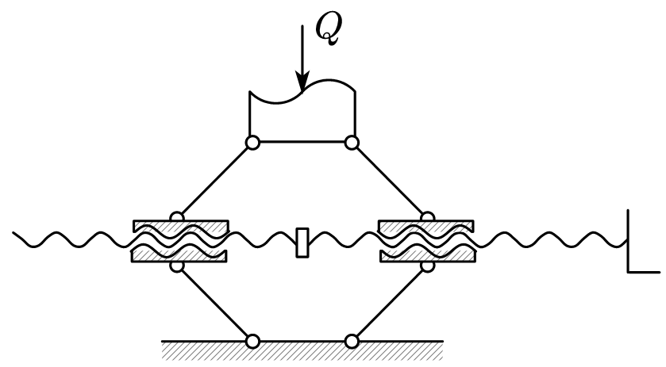

# Screw Jack Design

## Overview

### Working Principle and Design Parameters

The screw jack works by reciprocating the handle, which rotates a rod to drive the nut, causing the lifting screw to rotate and raise or lower the lifting cup, thus achieving the lifting and pulling force. The jack uses a screw transmission to convert the rotational motion of the screw into linear motion, while also transmitting motion and power. The screw transmission has advantages such as a large transmission ratio, self-locking ability, compact structure, and high precision.

| Design Parameter                | 数值 [单位] |
| ------------------------------- | ----------- |
| Maximum Lifting Capacity$Q$   | 20 [kN]     |
| Maximum Lifting Distance $h$ | 120 [mm]    |

The material selection and design of the jack need to meet functional requirements, economic considerations, and durability and reliability requirements.

### Design Proposal (Simplified Diagram)

#### Proposal 1: Vertical Screw Jack

As shown in the figure, the handle can slide to adjust the lever arm length. Turning the handle raises the screw, thus lifting the heavy object.

			<!--块级封装-->
    
	<!--将图片和文字居中-->
    
     		<!--换行-->
    Figure 1: Vertical Screw Jack Schematic	<!--标题-->
    

#### Proposal 2: Scissors Screw Jack

As shown in the figure, the screw rotates in opposite directions on both sides, and turning the handle causes the two nuts to move in opposite directions, lifting or lowering the object.

			<!--块级封装-->
    
	<!--将图片和文字居中-->
    
     		<!--换行-->
    Figure 2: Scissors Screw Jack Schematic	<!--标题-->
    

We will use Proposal 1 as an example for the design calculations.

## Design and Calculation of the Screw

### Selection of Screw Thread Type

Based on the relationship between the screw and the nut's movement, the nut is fixed in the jack, and the screw rotates and moves. It serves as a power transmission screw. For this design, a **single-thread screw** (GB5796-86) is chosen. The commonly used thread type is  **right-hand thread** , and for sliding screw transmissions, trapezoidal and sawtooth threads are commonly used. Since the trapezoidal thread has a good fit between the inner and outer threads and has a high root strength, we choose a **trapezoidal thread** for calculation, with the tooth profile being an isosceles trapezoid and the thread angle $\alpha=30^\circ$。

### Material Selection for the Screw

Common materials for the screw include $Q235$, $Q275$, $45$, and $50$ steel. For parts that require high wear resistance, materials such as $T12$, $65Mn$, $40Cr$, and $18CrMnTi$ are used. Since the jack operates at low speed, with only moderate stress on each surface, and considering the overall economic factors, **45 steel** is chosen. According to the national standard "High-Quality Carbon Structural Steel" (GB/T699-2015), the tensile strength of $45$ steel is $\sigma_b = 600$ MPa, $\sigma_s = 355$ MPa, and the elastic modulus $E = 2.06 \times 10^5$ MPa.

### Determining the Thread Diameter

The contact pressure $p$ of the thread surface needs to be limited to below the permissible pressure of the screw pair $[p]$, i.e.

$$
p  =\frac{Q}{\pi d_2 h Z}=\frac{QP}{\pi d_2 h H}\leq[p]
$$

Where $Q$ is the axial load, $d_2$ is the thread middle diameter, $H$ is the nut height, $P$ is the pitch, and $h$ is the thread contact height. Therefore, we have

$$
d_2\geq\sqrt{\frac{Q}{\pi\varphi\psi[p]}}
$$

where $\psi = \frac{H}{d_2}$ represents the ratio of nut height to middle diameter, and $\varphi = \frac{h}{P}$ represents the ratio of thread contact height to pitch. For trapezoidal threads, $\varphi = 0.5$, and since the nut is an integral nut, $\psi$ is generally between 1.2 and 2.5. In this case, we take $\psi = 1.8$.

For the screw-nut pair made of steel and bronze, the permissible contact pressure is taken as $[p] = 20$ MPa. With a load of $Q = 20$ kN, we can calculate

$$
d_2\geq18.81mm
$$

Referring to the national standard "Trapezoidal Threads Part 2: Diameters and Pitch Series" (GB/T 5796.2-2022), the preferred nominal diameter is $d = 28$ mm. From the standard "Trapezoidal Threads Part 3: Basic Dimensions" (GB/T 5796.3-2022), the middle diameter of the thread is $d_2 = 25.5$ mm, and the pitch is $P = 5$ mm. The nut height is calculated as $H = \psi d_2 = 45.9$ mm. Since the load distribution on the threads is not uniform, the number of threads on the nut $Z$ should not exceed 10. The calculation yields $Z = \frac{H}{P} = 9.18 < 10$,  **meeting the requirements** .

So the surface working pressure is calculated as

$$
p=\frac{Q}{\pi d_2 \varphi H}=10.88MPa<[p]=20MPa
$$

**Meeting the requirements** . The single-thread lead is $S = P = 5$ mm. The root width of the thread is $b = 0.65P = 3.25$ mm, and the thread angle $\lambda = \arctan \frac{S}{\pi d_2} = 3.571^\circ$.

The detailed thread parameters are as follows

| Nominal Diameter [mm] | Pitch [mm] | Internal/External Thread Middle Diameter$d_2=D_2$[mm] | Internal Thread Major Diameter$D_4$ [mm] | External Thread Minor Diameter$d_3$[mm] | Internal Thread Minor Diameter$D_1$[mm] | Thread Root Width$b$ [mm] | Lead Angle$\lambda$ | Thread Angle$\alpha$ |
| --------------------- | ----------- | ------------------------------------------------------- | ------------------------------------------ | ----------------------------------------- | ----------------------------------------- | --------------------------- | --------------------- | ---------------------- |
| 28                    | 5           | 25.500                                                  | 28.500                                     | 22.500                                    | 23.000                                    | 3.25                        | 3.571°               | 30°                   |

---

### Self-locking Check

The friction coefficient $\mu$ between steel and bronze is between 0.08 and 0.10. We take the lower value $\mu = 0.08$, and the thread angle $\alpha = 30^\circ$.

$$
\varphi_v=\arctan\frac{\mu}{\cos\beta}=\arctan\frac{\mu}{\cos\frac{\alpha}{2}}=4.735^\circ\\
$$

Since $\lambda = 3.571^\circ < \varphi_v$, the screw pair  **meets the self-locking requirement** .

### Screw Structure Design

The upper end of the screw supports the lifting cup and installs the handle, so its diameter must be increased. Temporarily, we set $D_S = 2d = 56$ mm, and the length of the enlarged portion is $l_s = 1.5d = 42$ mm.

The hole diameter $d_k$ for the handle is determined based on the handle's diameter $d_p$, with $d_k \approx d_p + (0.5 \sim 1) , \text{mm}$, and we set $d_k = 22.5$ mm.

In order to facilitate the cutting of the thread, a tool relief slot is provided at the top of the thread. The diameter of the relief slot $d_c$ is about $0.2 \sim 0.5$ mm smaller than the screw diameter $D_1$. We take $d_c = 22$ mm. The width of the relief slot is set to $l_c = 1.5P \approx 8$ mm.

To facilitate the screw insertion into the nut, the lower end of the screw has a chamfer, and the chamfer size is uniform, denoted as $c2$.

Considering the maximum lifting height of the jack, the width of the relief slot, and the actual nut height, the equivalent length of the screw is

$$
l_B =h+l_c+H'= 178mm
$$

### Screw Strength Check

The screws subjected to larger forces need to be strength-checked using the fourth strength theory. While working, the screw bears axial pressure $Q$ and torque $T$, resulting in both compressive and shear stresses at the dangerous section of the screw. The torque acting on the screw is

$$
T = \frac{Qd_2\tan(\psi+\varphi_v)}{2}=29.21N\cdot m
$$

The screw material is $45$ steel, with a safety factor of $3 \sim 5$, taking the maximum value of $5$. The allowable stress is $[\sigma] = \sigma_s / 5 = 71 MPa$

$$
\sigma = \sqrt{\sigma^2+3\tau^2}=\sqrt{\left(\frac{Q}{A}\right)^2 + 3\left(\frac{T}{W_T}\right)^2}
$$

For a cylindrical screw, $A = \frac{\pi d_3^2}{4}$, $W_T = \frac{\pi d_3^3}{16} = A\frac{d_3}{4}$. The inner thread minor diameter of the screw is $d_3 = 22.500mm$, and by substituting this into the calculation, we get $\sigma = 55.15 MPa < [\sigma] = 71 MPa$. Therefore, this screw **meets the strength requirements** .

### Stability Check

For screws with a large length-to-diameter ratio under compression, when the axial load $Q$ exceeds a certain critical value, the screw will suddenly buckle and lose stability. The critical load $Q_c$ exists, and the stability condition for the screw is

$$
\frac{Q_c}{Q}\geq S_s
$$

where $S_s$ is the minimum safety factor to ensure the screw does not lose stability. For the power transmission screw, $S_s = 3.5 \sim 5.0$, taking the maximum value of $S_s = 5$. According to material mechanics, the critical load $Q$ for instability is related to the screw’s flexibility $\lambda_s = \frac{\mu l}{i}$, where $l$ is the length of the section of the screw under pressure, and $i$ is the radius of inertia of the screw's dangerous section. If the dangerous section is approximated as a circle with diameter $d_3$ (the thread minor diameter), then $i = \frac{d_3}{4}$, and all units are in $mm$. The length coefficient $\mu$ for the screw is $2$ (for a screw jack with one end fixed and one end free).

$$
\lambda_s = \frac{\mu l_B}{i}=63.29>40
$$

Stability check is required. When $40 < \lambda_s < 100$, for high-quality carbon steel, we take

$$
Q_c = (461-2.568\lambda_s)\frac{\pi d_3^2}{4}=118.67kN
$$

$$
\frac{Q_c}{Q} =5.934>S_s=5
$$

Thus, the screw **meets the stability condition**.

### Retaining Ring Design

To prevent the screw from coming out of the nut during operation, a steel retaining ring must be installed at the lower end of the screw (GB/T 891-1986). The retaining ring is fixed at the end of the screw with a cross-slot countersunk screw (GB/T 819.1-2016).

According to GB891-86, for screws with a nominal diameter $d = 28$ mm, the nominal diameter of the retaining ring should be $D = 35$ mm, with $H = 5$ mm, $L = 10$ mm, a small diameter of $d = 6.6$ mm, $d_1 = 3.2$ mm, $D_1 = 13$ mm, and $c = 1$ mm. The screw is $M6 \times 16$.

## Nut Design and Calculation

### Material Selection and Structural Design of the Nut

In addition to sufficient strength, the material of the nut should have a low friction coefficient and good wear resistance when paired with the screw. To suit heavy-load low-speed transmission, **cast aluminum bronze** $\text{ZQAl9-4-4-2}$ is chosen, with allowable shear stress $[\tau] = 30 \sim 40$ MPa and allowable bending stress $[\sigma_b] = 40 \sim 60$ MPa.

### Determining the Number of Thread Engagements and Nut Height

The nut height is given by

$$
H =\psi d_2= 45.9mm
$$

The number of engaged threads is

$$
u=\frac{H}{P}=9.18
$$

Considering the effect of the tool relief slot, the number of thread turns for the nut (rounded to an integer) is:

$$
u'=u+1=10.18\approx10
$$

The actual height of the nut is

$$
H'=u'P=50mm
$$

### Nut Thread Strength Check

Thread failure often occurs due to shear or compression, and generally, the strength of the nut is lower than that of the screw. Therefore, only the strength of the nut threads needs to be checked.

The shear strength condition for the dangerous section of the thread

$$
\tau = \frac{Q}{\pi D_4 b u'}\leq[\tau]
$$

The bending strength condition for the dangerous interface of the thread

$$
\sigma = \frac{6Ql}{\pi D_4 b^2 u'}\leq[\sigma_b]
$$

where $b$ is the root thickness of the thread. For trapezoidal threads, $b = 0.65P = 3.25 , \text{mm}$, $l$ is the bending lever arm, and $l = \frac{D - D_2}{2} = 1.5 , \text{mm}$, with the internal thread major diameter $D_4 = 28.5 , \text{mm}$. For bronze materials, the allowable shear stress $[\tau] = 30 \sim 40$ MPa and the allowable bending stress $[\sigma_b] = 40 \sim 60$ MPa. We take the lower values: $[\tau] = 30 , \text{MPa}$ and $[\sigma_b] = 40 , \text{MPa}$. Substituting the values

$$
\tau=\frac{Q}{\pi D_4 b u'}=6.87MPa\leq[\tau]\\
\sigma=\frac{6Ql}{\pi D_4 b^2u'}=19.03MPa\leq[\sigma_b]
$$

Thus, the nut thread  **meets the strength requirements**.

### External Dimension Design and Check for the Nut

取螺母外径 $D_N = 50mm\approx1.8d$，螺母凸缘直径 $D_{N1}=65mm=1.3D_N$，螺母凸缘厚度 $a=22mm=0.4H'$。

#### 拉扭组合校核

螺母凸缘处受拉、扭组合作用，需要进行强度校核，由于数据信息少，扭转力矩大小难以精确计算，估算拉应力约为 $F = 35kN\cdot m\approx1.3Q$,

$$
\sigma'=\frac{F}{0.25\pi(D_N^2-d^2)}<[\sigma]
$$

取许用拉应力 $[ \sigma ] = 40\text{MPa}$，计算得到

$$
\sigma' = 19.29 \text{ MPa} < [ \sigma ] = 40 \text{ MPa}
$$

，

**满足强度要求**

。

#### 凸缘与底座挤压校核

凸缘与底座接触部分存在挤压，需要进行挤压强度计算，

$$
\sigma_p=\frac{Q}{0.25\pi(D_{N1}^2-D_N^2)}<[\sigma_p]
$$

取许用挤压应力 $[ \sigma_p ] = 75\text{MPa}$，计算得到

$$
\sigma_p' = 19.19 \text{ MPa} < [ \sigma_p ] = 75 \text{ MPa}
$$

，故可以认为/

**满足挤压强度要求**

。

#### 凸缘根部强度计算

凸缘根部需要进行弯曲强度计算，

$$
\sigma_b=\frac{Q(D_{N1}-D_N)}{\pi D_Na^2}<[\sigma_b]
$$

代入计算$\sigma_b'=3.95\text{MPa}<[\sigma_b]$，**满足弯曲强度要求**。

根据 $\text{GB/T 77-2007}$，这里使用内六角平端紧定螺钉 $\text{M12}$。

## 托杯设计与计算

### 托杯材料选择与结构设计

托杯用于承托重物，可以用$\text{ Q235}$ 钢模锻制成，材料为$\text{ Q235}$。其结构尺寸见图。为了与重物接触良好并防止相对滑动，在杯托上表面制有切口的沟纹。为了防止杯托从螺杆端部脱落，在螺杆上端装有挡板。

### 托杯尺寸设计与强度校核

当螺杆转动时，杯托和重物不作相对转动。因此在起重时，杯托底部与螺杆和接触面有相对滑动。为了避免过快磨损，一方面需要润滑，另一方面还需要验算接触面间的压力强度。

$$
p=\frac{Q}{\frac{\pi}{4}(D_S'^2-D_S''^2)}\leq[p]
$$

其中，$[ p ]$ 为许用压强，应为杯托与螺杆材料许用压强的较小值，查表知$\text{Q235}$的许用压强较小，取 $[ p ] =[p]_\text{杯} =225$ MPa。

取杯托外径$D_S=58mm$，杯托直径$D_S'=D_S-(2\sim4)$，取$D_S'=54mm$，直径$D_S''=d+(1\sim2)$，取$D_S''=30mm$，代入公式

$$
p=\frac{Q}{\frac{\pi}{4}(D_S'^2-D_S''^2)}=12.63MPa\leq[p]=225MPa
$$

**满足强度要求**。

杯托外口径$D_3=70\approx2.5dmm$。杯托厚度取$\delta=8mm$，杯底厚度为$\delta_b\approx1.5\delta=10mm$，沟纹宽度为$1.5\delta=12mm$，沟纹深度为$\delta_d=\delta/2=6mm$，杯托高度为$h_c\approx2d=60mm$，为保证杯托可以转动，螺杆顶部的垫片和杯托底部留有间隙，间隙值为$3\sim4mm$，因承受力不大，故取值为$3mm$。

## 手柄设计与计算

### 手柄材料选择与结构设计

手柄的材料选择为常用的 45 号钢。其许用应力常取为 $[\sigma] = 160MPa$。将手柄插入螺杆上部的孔中，为防止手柄从孔中滑出，在手柄两端应加上手把，并用螺钉固定。

### 确定手柄长度

手柄上的工作转矩包括螺纹副摩擦力矩与接触面摩擦力矩

$$
T=F_HL_H=T_1+T_2
$$

螺旋副间的摩擦阻力矩

$$
T_1 =Q\tan(\psi+\rho_v) \frac{d_2}{2}
$$

杯托与轴端支承面的摩擦力矩

$$
T_2 =Q\cdot \frac{1}{3}f_c \frac{D_0^3-d_0^3}{D_0^2-d_0^2}
$$

取 $D_0=D_s'=54mm$,$d_0=D_s''=30mm$，人手的最大操作力 $F_H = 300N$，给出$f_c=0.12$，代入可求得$T_1=29.21N$，$T_2=51.77N$手柄的有效长度

$$
L_H=269.9mm
$$

取手柄长度为 $L_H = 271 mm$，该距离为螺杆中心到人手施力点的距离，考虑螺杆头部尺寸和人工握手距离，适当增加手柄实际长度。

$$
L_H'=L_H+\frac{D_S}{2}+50mm=350mm
$$

### 确定手柄直径

Q235 的许用应力 $[\sigma] = 160$ MPa，可将手柄看作一个悬臂梁，按照弯曲强度确定手柄直径,

$$
\sigma_b=\frac{F_HL_H}{W}=\frac{F_HL_H}{\frac{\pi}{32}d_k^3}\leq[\sigma_b]
$$

计算得到

$$
d_p\geq \sqrt[3]{\frac{32F_HL_H}{\pi[\sigma_b]}}=17.28mm
$$

可适当取大，取 $d_p = 22 mm$。

## 底座设计

底座材料常用铸铁$ HT150 $及$ HT200$，选用$ HT150$。铸件的壁厚取 $\delta = 10mm$，为防止裂纹和缩孔，对所有小于$120^\circ$的角取圆角$R2$。为了增加底座的稳定性，底部尺寸应大些，因此将其外形制成约$ 1:5 $的斜度。

底座高度考虑螺母高度，推程和一定的距离裕度，取$H = 180mm$，底座与螺母相套处直径为

$$
D_{B1} = D_N = 50 \text{mm}
$$

按照斜度计算底座斜段下方直径：

$$
D_{B2} = D_{B1 }+ \frac{1}{5}(H-H_2) =102 \text{mm}
$$

应按照挤压强度计算底座最大尺寸$D_{B3}$，其中灰铸铁和混凝土的许用挤压应力 $[\sigma_p] = 4.5MPa$

$$
\sigma_p=\frac{Q}{\frac{\pi}{4}(D_{B3}^2-D_{B2}^2)}\geq[\sigma_p]\\
D_{B3}\geq\sqrt{\frac{4Q}{\pi[\sigma_p]}+D_{B2}^2}=126.7mm
$$

适当取大，取底座最大尺寸 $d_{B3}=150mm$。

## 装配图绘制

见附页。

## 参考资料

1. 陈秀宁, 顾大强. 机械设计[M]. 第3版. 杭州: 浙江大学出版社，2018.
2. 刘鸿文, 材料力学$\text{I}$[M]. 第6版. 北京: 高等教育出版社, 2017: 316.

部分资料来源网络和机械设计有关国家标准。
