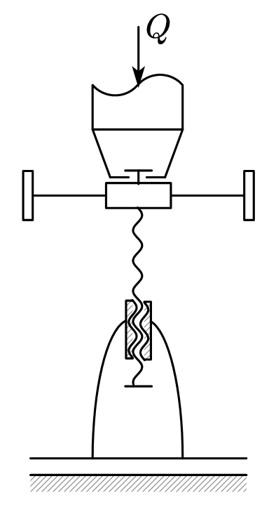

# Screw Jack Design

## Overview

### Working Principle and Design Parameters

The screw jack works by reciprocating the handle, which rotates a rod to drive the nut, causing the lifting screw to rotate and raise or lower the lifting cup, thus achieving the lifting and pulling force. The jack uses a screw transmission to convert the rotational motion of the screw into linear motion, while also transmitting motion and power. The screw transmission has advantages such as a large transmission ratio, self-locking ability, compact structure, and high precision.

| Design Parameter              | 数值 [单位] |
| ----------------------------- | ----------- |
| Maximum Lifting Capacity$Q$ | 20 [kN]     |
| Maximum Lifting Distance$h$ | 120 [mm]    |

The material selection and design of the jack need to meet functional requirements, economic considerations, and durability and reliability requirements.

### Design Proposal (Simplified Diagram)

#### Proposal 1: Vertical Screw Jack

As shown in the figure, the handle can slide to adjust the lever arm length. Turning the handle raises the screw, thus lifting the heavy object.

			<!--块级封装-->
    
	<!--将图片和文字居中-->
    
     		<!--换行-->
    Figure 1: Vertical Screw Jack Schematic	<!--标题-->
    

#### Proposal 2: Scissors Screw Jack

As shown in the figure, the screw rotates in opposite directions on both sides, and turning the handle causes the two nuts to move in opposite directions, lifting or lowering the object.

			<!--块级封装-->
    
	<!--将图片和文字居中-->
    
     		<!--换行-->
    Figure 2: Scissors Screw Jack Schematic	<!--标题-->
    

We will use Proposal 1 as an example for the design calculations.

## Design and Calculation of the Screw

### Selection of Screw Thread Type

Based on the relationship between the screw and the nut's movement, the nut is fixed in the jack, and the screw rotates and moves. It serves as a power transmission screw. For this design, a **single-thread screw** (GB5796-86) is chosen. The commonly used thread type is  **right-hand thread** , and for sliding screw transmissions, trapezoidal and sawtooth threads are commonly used. Since the trapezoidal thread has a good fit between the inner and outer threads and has a high root strength, we choose a **trapezoidal thread** for calculation, with the tooth profile being an isosceles trapezoid and the thread angle $\alpha=30^\circ$。

### Material Selection for the Screw

Common materials for the screw include $Q235$, $Q275$, $45$, and $50$ steel. For parts that require high wear resistance, materials such as $T12$, $65Mn$, $40Cr$, and $18CrMnTi$ are used. Since the jack operates at low speed, with only moderate stress on each surface, and considering the overall economic factors, **45 steel** is chosen. According to the national standard "High-Quality Carbon Structural Steel" (GB/T699-2015), the tensile strength of $45$ steel is $\sigma_b = 600$ MPa, $\sigma_s = 355$ MPa, and the elastic modulus $E = 2.06 \times 10^5$ MPa.

### Determining the Thread Diameter

The contact pressure $p$ of the thread surface needs to be limited to below the permissible pressure of the screw pair $[p]$, i.e.

$$
p  =\frac{Q}{\pi d_2 h Z}=\frac{QP}{\pi d_2 h H}\leq[p]
$$

Where $Q$ is the axial load, $d_2$ is the thread middle diameter, $H$ is the nut height, $P$ is the pitch, and $h$ is the thread contact height. Therefore, we have

$$
d_2\geq\sqrt{\frac{Q}{\pi\varphi\psi[p]}}
$$

where $\psi = \frac{H}{d_2}$ represents the ratio of nut height to middle diameter, and $\varphi = \frac{h}{P}$ represents the ratio of thread contact height to pitch. For trapezoidal threads, $\varphi = 0.5$, and since the nut is an integral nut, $\psi$ is generally between 1.2 and 2.5. In this case, we take $\psi = 1.8$.

For the screw-nut pair made of steel and bronze, the permissible contact pressure is taken as $[p] = 20$ MPa. With a load of $Q = 20$ kN, we can calculate

$$
d_2\geq18.81mm
$$

Referring to the national standard "Trapezoidal Threads Part 2: Diameters and Pitch Series" (GB/T 5796.2-2022), the preferred nominal diameter is $d = 28$ mm. From the standard "Trapezoidal Threads Part 3: Basic Dimensions" (GB/T 5796.3-2022), the middle diameter of the thread is $d_2 = 25.5$ mm, and the pitch is $P = 5$ mm. The nut height is calculated as $H = \psi d_2 = 45.9$ mm. Since the load distribution on the threads is not uniform, the number of threads on the nut $Z$ should not exceed 10. The calculation yields $Z = \frac{H}{P} = 9.18 < 10$,  **meeting the requirements** .

So the surface working pressure is calculated as

$$
p=\frac{Q}{\pi d_2 \varphi H}=10.88MPa<[p]=20MPa
$$

**Meeting the requirements** . The single-thread lead is $S = P = 5$ mm. The root width of the thread is $b = 0.65P = 3.25$ mm, and the thread angle $\lambda = \arctan \frac{S}{\pi d_2} = 3.571^\circ$.

The detailed thread parameters are as follows

| Nominal Diameter [mm] | Pitch [mm] | Internal/External Thread Middle Diameter$d_2=D_2$[mm] | Internal Thread Major Diameter$D_4$ [mm] | External Thread Minor Diameter$d_3$[mm] | Internal Thread Minor Diameter$D_1$[mm] | Thread Root Width$b$ [mm] | Lead Angle$\lambda$ | Thread Angle$\alpha$ |
| --------------------- | ----------- | ------------------------------------------------------- | ------------------------------------------ | ----------------------------------------- | ----------------------------------------- | --------------------------- | --------------------- | ---------------------- |
| 28                    | 5           | 25.500                                                  | 28.500                                     | 22.500                                    | 23.000                                    | 3.25                        | 3.571°               | 30°                   |

---

### Self-locking Check

The friction coefficient $\mu$ between steel and bronze is between 0.08 and 0.10. We take the lower value $\mu = 0.08$, and the thread angle $\alpha = 30^\circ$.

$$
\varphi_v=\arctan\frac{\mu}{\cos\beta}=\arctan\frac{\mu}{\cos\frac{\alpha}{2}}=4.735^\circ\\
$$

Since $\lambda = 3.571^\circ < \varphi_v$, the screw pair  **meets the self-locking requirement** .

### Screw Structure Design

The upper end of the screw supports the lifting cup and installs the handle, so its diameter must be increased. Temporarily, we set $D_S = 2d = 56$ mm, and the length of the enlarged portion is $l_s = 1.5d = 42$ mm.

The hole diameter $d_k$ for the handle is determined based on the handle's diameter $d_p$, with $d_k \approx d_p + (0.5 \sim 1) , \text{mm}$, and we set $d_k = 22.5$ mm.

In order to facilitate the cutting of the thread, a tool relief slot is provided at the top of the thread. The diameter of the relief slot $d_c$ is about $0.2 \sim 0.5$ mm smaller than the screw diameter $D_1$. We take $d_c = 22$ mm. The width of the relief slot is set to $l_c = 1.5P \approx 8$ mm.

To facilitate the screw insertion into the nut, the lower end of the screw has a chamfer, and the chamfer size is uniform, denoted as $c2$.

Considering the maximum lifting height of the jack, the width of the relief slot, and the actual nut height, the equivalent length of the screw is

$$
l_B =h+l_c+H'= 178mm
$$

### Screw Strength Check

The screws subjected to larger forces need to be strength-checked using the fourth strength theory. While working, the screw bears axial pressure $Q$ and torque $T$, resulting in both compressive and shear stresses at the dangerous section of the screw. The torque acting on the screw is

$$
T = \frac{Qd_2\tan(\psi+\varphi_v)}{2}=29.21N\cdot m
$$

The screw material is $45$ steel, with a safety factor of $3 \sim 5$, taking the maximum value of $5$. The allowable stress is $[\sigma] = \sigma_s / 5 = 71 MPa$

$$
\sigma = \sqrt{\sigma^2+3\tau^2}=\sqrt{\left(\frac{Q}{A}\right)^2 + 3\left(\frac{T}{W_T}\right)^2}
$$

For a cylindrical screw, $A = \frac{\pi d_3^2}{4}$, $W_T = \frac{\pi d_3^3}{16} = A\frac{d_3}{4}$. The inner thread minor diameter of the screw is $d_3 = 22.500mm$, and by substituting this into the calculation, we get $\sigma = 55.15 MPa < [\sigma] = 71 MPa$. Therefore, this screw **meets the strength requirements** .

### Stability Check

For screws with a large length-to-diameter ratio under compression, when the axial load $Q$ exceeds a certain critical value, the screw will suddenly buckle and lose stability. The critical load $Q_c$ exists, and the stability condition for the screw is

$$
\frac{Q_c}{Q}\geq S_s
$$

where $S_s$ is the minimum safety factor to ensure the screw does not lose stability. For the power transmission screw, $S_s = 3.5 \sim 5.0$, taking the maximum value of $S_s = 5$. According to material mechanics, the critical load $Q$ for instability is related to the screw’s flexibility $\lambda_s = \frac{\mu l}{i}$, where $l$ is the length of the section of the screw under pressure, and $i$ is the radius of inertia of the screw's dangerous section. If the dangerous section is approximated as a circle with diameter $d_3$ (the thread minor diameter), then $i = \frac{d_3}{4}$, and all units are in $mm$. The length coefficient $\mu$ for the screw is $2$ (for a screw jack with one end fixed and one end free).

$$
\lambda_s = \frac{\mu l_B}{i}=63.29>40
$$

Stability check is required. When $40 < \lambda_s < 100$, for high-quality carbon steel, we take

$$
Q_c = (461-2.568\lambda_s)\frac{\pi d_3^2}{4}=118.67kN
$$

$$
\frac{Q_c}{Q} =5.934>S_s=5
$$

Thus, the screw **meets the stability condition**.

### Retaining Ring Design

To prevent the screw from coming out of the nut during operation, a steel retaining ring must be installed at the lower end of the screw (GB/T 891-1986). The retaining ring is fixed at the end of the screw with a cross-slot countersunk screw (GB/T 819.1-2016).

According to GB891-86, for screws with a nominal diameter $d = 28$ mm, the nominal diameter of the retaining ring should be $D = 35$ mm, with $H = 5$ mm, $L = 10$ mm, a small diameter of $d = 6.6$ mm, $d_1 = 3.2$ mm, $D_1 = 13$ mm, and $c = 1$ mm. The screw is $M6 \times 16$.

## Nut Design and Calculation

### Material Selection and Structural Design of the Nut

In addition to sufficient strength, the material of the nut should have a low friction coefficient and good wear resistance when paired with the screw. To suit heavy-load low-speed transmission, **cast aluminum bronze** $\text{ZQAl9-4-4-2}$ is chosen, with allowable shear stress $[\tau] = 30 \sim 40$ MPa and allowable bending stress $[\sigma_b] = 40 \sim 60$ MPa.

### Determining the Number of Thread Engagements and Nut Height

The nut height is given by

$$
H =\psi d_2= 45.9mm
$$

The number of engaged threads is

$$
u=\frac{H}{P}=9.18
$$

Considering the effect of the tool relief slot, the number of thread turns for the nut (rounded to an integer) is:

$$
u'=u+1=10.18\approx10
$$

The actual height of the nut is

$$
H'=u'P=50mm
$$

### Nut Thread Strength Check

Thread failure often occurs due to shear or compression, and generally, the strength of the nut is lower than that of the screw. Therefore, only the strength of the nut threads needs to be checked.

The shear strength condition for the dangerous section of the thread

$$
\tau = \frac{Q}{\pi D_4 b u'}\leq[\tau]
$$

The bending strength condition for the dangerous interface of the thread

$$
\sigma = \frac{6Ql}{\pi D_4 b^2 u'}\leq[\sigma_b]
$$

where $b$ is the root thickness of the thread. For trapezoidal threads, $b = 0.65P = 3.25 \text{mm}$, $l$ is the bending lever arm, and $l = \frac{D - D_2}{2} = 1.5 \text{mm}$, with the internal thread major diameter $D_4 = 28.5 \text{mm}$. For bronze materials, the allowable shear stress $[\tau] = 30 \sim 40$ MPa and the allowable bending stress $[\sigma_b] = 40 \sim 60$ MPa. We take the lower values: $[\tau] = 30 \text{MPa}$ and $[\sigma_b] = 40 \text{MPa}$. Substituting the values

$$
\tau=\frac{Q}{\pi D_4 b u'}=6.87MPa\leq[\tau]\\
\sigma=\frac{6Ql}{\pi D_4 b^2u'}=19.03MPa\leq[\sigma_b]
$$

Thus, the nut thread **meets the strength requirements**.

### External Dimension Design and Check for the Nut

The external diameter of the nut is chosen as $D_N = 50 \text{mm} \approx 1.8d$, and the flange diameter of the nut is $D_{N1} = 65 \text{mm} = 1.3D_N$, with the flange thickness $a = 22 \text{mm} = 0.4H'$.

#### Tensile and Torsion Combination Check

The nut flange is subjected to both tensile and torsional forces, so a strength check is required. Due to limited data, it is difficult to calculate the torsional moment accurately, but the tensile stress is roughly estimated as $F = 35 \text{kN} \cdot \text{m} \approx 1.3Q$

$$
\sigma'=\frac{F}{0.25\pi(D_N^2-d^2)}<[\sigma]
$$

Taking the allowable tensile stress $[\sigma] = 40 \text{MPa}$, the calculation gives

$$
\sigma' = 19.29 \text{ MPa} < [ \sigma ] = 40 \text{ MPa}
$$

**Meets the strength requirements**.

#### Compression Check for the Flange and Base Contact

There is compression at the contact between the flange and the base, requiring a compression strength calculation，

$$
\sigma_p=\frac{Q}{0.25\pi(D_{N1}^2-D_N^2)}<[\sigma_p]
$$

Taking the allowable compression stress $[\sigma_p] = 75 \text{MPa}$, the calculation gives

$$
\sigma_p' = 19.19 \text{ MPa} < [ \sigma_p ] = 75 \text{ MPa}
$$

Therefore, it can be considered  **to meet the compression strength requirement**.

#### Bending Strength Check at the Flange Root

The bending strength at the flange root needs to be calculated，

$$
\sigma_b=\frac{Q(D_{N1}-D_N)}{\pi D_Na^2}<[\sigma_b]
$$

Substituting values, we get $\sigma_b' = 3.95 \text{MPa} < [\sigma_b]$, which  **meets the bending strength requirement**.

According to  **GB/T 77-2007** , an internal hexagonal flat-head set screw **M12** is used here.

## Lifting Cup Design and Calculation

### Material Selection and Structural Design of the Lifting Cup

The lifting cup, which supports the heavy load, is made from $\text{Q235}$ steel using forging. The structure dimensions are shown in the diagram. To ensure good contact with the load and prevent relative movement, grooves are made on the upper surface of the cup. To prevent the lifting cup from falling off the screw end, a baffle is installed at the upper end of the screw.

### Lifting Cup Dimension Design and Strength Check

When the screw rotates, the lifting cup and the load do not rotate relative to each other. Therefore, during lifting, there is relative sliding between the bottom of the lifting cup and the screw and contact surface. To prevent rapid wear, lubrication is required, and the contact pressure between the surfaces needs to be checked.

$$
p=\frac{Q}{\frac{\pi}{4}(D_S'^2-D_S''^2)}\leq[p]
$$

where $[p]$ is the allowable contact pressure, taken as the smaller of the allowable pressures of the lifting cup and screw materials. According to the table, the allowable pressure for $\text{Q235}$ is smaller, so we take $[p] = [p]_\text{cup} = 225$ MPa.

Taking the outer diameter of the lifting cup as $D_S = 58 \text{mm}$, the inner diameter $D_S' = D_S - (2 \sim 4)$, we take $D_S' = 54 \text{mm}$, and the diameter $D_S'' = d + (1 \sim 2)$, we take $D_S'' = 30 \text{mm}$. Substituting into the formula

$$
p=\frac{Q}{\frac{\pi}{4}(D_S'^2-D_S''^2)}=12.63MPa\leq[p]=225MPa
$$

**Meets the strength requirements**.

The outer diameter of the lifting cup is $D_3 = 70 \text{mm} \approx 2.5d$. The cup thickness is $\delta = 8 \text{mm}$, the bottom thickness is $\delta_b \approx 1.5\delta = 10 \text{mm}$, the groove width is $1.5\delta = 12 \text{mm}$, and the groove depth is $\delta_d = \frac{\delta}{2} = 6 \text{mm}$. The height of the lifting cup is $h_c \approx 2d = 60 \text{mm}$. To ensure the lifting cup can rotate, a gap of $3 \sim 4 \text{mm}$ is left between the spacer at the top of the screw and the bottom of the lifting cup. Since the load is not large, a value of $3 \text{mm}$ is taken.

## Handle Design and Calculation

### Handle Material Selection and Structural Design

The material selected for the handle is the commonly used  **45 steel** . Its allowable stress is typically taken as $[\sigma] = 160 \text{ MPa}$. The handle is inserted into the hole at the upper end of the screw, and to prevent the handle from slipping out of the hole, handles should be added at both ends and fixed with screws.

### Determining the Handle Length

The work torque on the handle includes both the friction torque of the screw pair and the friction torque on the contact surfaces

$$
T=F_HL_H=T_1+T_2
$$

The friction torque between the threads

$$
T_1 =Q\tan(\psi+\rho_v) \frac{d_2}{2}
$$

The friction torque at the cup support and shaft end bearing surface

$$
T_2 =Q\cdot \frac{1}{3}f_c \frac{D_0^3-d_0^3}{D_0^2-d_0^2}
$$

Taking $D_0 = D_s' = 54 \text{mm}$, $d_0 = D_s'' = 30 \text{mm}$, and the maximum human operational force $F_H = 300 \text{N}$, with $f_c = 0.12$, we can calculate $T_1 = 29.21 \text{N}$ and $T_2 = 51.77 \text{N}$. The effective length of the handle is

$$
L_H=269.9mm
$$

The handle length is taken as $L_H = 271 , \text{mm}$, which is the distance from the screw center to the point where the hand applies force. Considering the size of the screw head and the manual grip distance, the actual length of the handle is appropriately increased

$$
L_H'=L_H+\frac{D_S}{2}+50mm=350mm
$$

### Determining the Handle Diameter

The allowable stress of Q235 is $[\sigma] = 160 \text{MPa}$. The handle can be regarded as a cantilever beam, and its diameter is determined based on bending strength

$$
\sigma_b=\frac{F_HL_H}{W}=\frac{F_HL_H}{\frac{\pi}{32}d_k^3}\leq[\sigma_b]
$$

Solving for the diameter

$$
d_p\geq \sqrt[3]{\frac{32F_HL_H}{\pi[\sigma_b]}}=17.28mm
$$

Considering the manual grip, a suitable value is chosen as $d_p = 22 \text{mm}$.

## Base Design

The material commonly used for the base is cast iron **HT150** or  **HT200** , and **HT150** is selected. The wall thickness of the casting is taken as $\delta = 10 \text{mm}$. To prevent cracks and shrinkage holes, all angles smaller than $120^\circ$ should have rounded corners $R2$. To increase the base's stability, the bottom dimensions should be larger, so the shape is designed with a slope of about $1:5$.

The base height, considering the nut height, stroke, and a certain distance margin, is taken as $H = 180 \text{mm}$. The diameter at the base's nut fit is

$$
D_{B1} = D_N = 50 \text{mm}
$$

The diameter at the bottom of the base's sloped section is calculated as

$$
D_{B2} = D_{B1 }+ \frac{1}{5}(H-H_2) =102 \text{mm}
$$

The base's maximum size $D_{B3}$ is calculated based on its extrusion strength. The allowable extrusion stress for gray cast iron and concrete is $[\sigma_p] = 4.5 \text{MPa}$

$$
\sigma_p=\frac{Q}{\frac{\pi}{4}(D_{B3}^2-D_{B2}^2)}\geq[\sigma_p]\\
$$

Solving for $D_{B3}$

$$
D_{B3}\geq\sqrt{\frac{4Q}{\pi[\sigma_p]}+D_{B2}^2}=126.7mm
$$

Choosing a suitable value, the base's maximum size is taken as $D_{B3} = 150 \text{mm}$.

## Assembly Drawing

## References

1. 陈秀宁, 顾大强. **Mechanical Design** [M]. 3rd Edition. Hangzhou: Zhejiang University Press, 2018.
2. 刘鸿文, **Materials Mechanics I** [M]. 6th Edition. Beijing: Higher Education Press, 2017: 316.

Some materials are sourced from online and national standards related to mechanical design.
